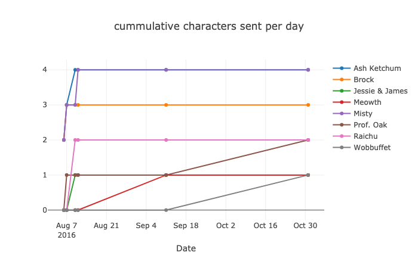

# [whatstk](http://lucasrodes.github.io/whatstk)


[](https://travis-ci.com/lucasrodes/whatstk)
[](https://github.com/lucasrodes/whatstk/blob/master/LICENSE)
[](https://github.com/lucasrodes/whatstk/stargazers)
[](https://github.com/lucasrodes/whatstk/network)

whatstk is a Python module for WhatsApp chat group analysis and distributed under the GPL-3.0 license.

The project was started in December 2016 by [lucasrodes](https://github.com/lucasrodes) and [albertaparicio](https://github.com/albertaparicio).

:star: Please **star** our project if you found it interesting to **keep us motivated** :smiley:!

### Installation

Tested on Python 3.7

```
pip install whatstk
```

### Getting Started

Make sure to first obtain the chat to be analyzed. Export it as a `txt` file using your phone (more info on this [here](https://lcsrg.me/whatstk-gui/#faqs)).


#### Obtain a dataframe from your chat log file

Load your chat using the object `WhatsAppChat`. Example below we use chat [example.txt](chats/example.txt)
 
 
```python
>>> from whatstk import WhatsAppChat

>>> filename = 'chats/example.txt'
>>> chat = WhatsAppChat.from_txt(filename)
```

Once you have your `WhatsAppChat` object, you can access the loaded data using the class attribute `df`, i.e. `chat.df`.

> ```python
> chat.df.info()
> ```
<details><summary>See results</summary>
<p>

```
<class 'pandas.core.frame.DataFrame'>
DatetimeIndex: 18 entries, 2016-08-06 13:23:00 to 2016-10-31 12:23:00
Data columns (total 2 columns):
 #   Column    Non-Null Count  Dtype 
---  ------    --------------  ----- 
 0   username  18 non-null     object
 1   message   18 non-null     object
dtypes: object(2)
memory usage: 432.0+ bytes
```

</p>
</details>

* _Note 1: By default, header auto-detect feature is used. If it does not work, use hformat variable to specify your
header format. In our example, it would be: `hformat = '%d.%m.%y, %H:%M - %name:'`. More on this [here](#header)_
* _Note 2: If your chat uses 12h clock, it may not work as expected. If it is your case, please report it in the issues section._


#### Plot the cumulative messages sent by day
Once you have your `WhatsAppChat` object, you can access the loadedvisualise the cumulative number of messages sent per day using the following 
code

```python
from whatstk import interventions
counts = interventions(chat, 'date', msg_length=False)
counts_cumsum = counts.cumsum()

# Plot result
from plotly.offline import plot
from whatstk.plot import vis
plot(vis(counts_cumsum, 'cumulative number of messages sent per day'))
```


*Note*: More examples to come soon.

### Contribute
We are very open to have collaborators. You can freely fork and issue a pull request with your updates!
For other issues/bugs/suggestions, please report it as an issue or [text me](mailto:lucasrg@kth.se).